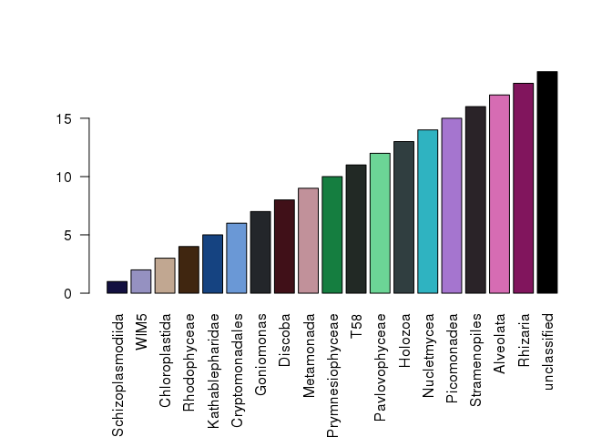

# Making a colour palette for multiple taxonomic levels
Julia Gustavsen  
06/06/2015  

# Overall motivation:
I wanted to pick many related colours from one colour. 

## More specific motivatation: 
I wanted to standardize my colour scheme that I am using for density plots, line graphs and other plots for some microbial data that is taxonomically assigned (e.g. 18S and 16S). It drives me nuts how often I see plots of taxonomic data that are not consistent between projects or even within projects. 

This is my attempt to pick some colour palettes at the Class level from a palette I worked out at the phylum level from the [IwantHue site](http://tools.medialab.sciences-po.fr/iwanthue/). I will use the functions describe here to also do this for order and family levels. 

# Resources I found helpful for working out how to do this:

* [R color cheatsheet](https://www.nceas.ucsb.edu/~frazier/RSpatialGuides/colorPaletteCheatsheet.pdf) Diagram that explains how HSV works is very useful and some R specific commands for investigating colours. 
* [Jenny Bryan's Using colors in R](http://www.stat.ubc.ca/~jenny/STAT545A/block14_colors.html#hexadecimal-rgb-color-specification) Nice discussion about how to use colours both qualitatively and quantitatively in R, how to use `RcolorBrewer` and more advanced discussion of hex codes and colour space. 
* [Vignette from colorspace](http://cran.r-project.org/web/packages/colorspace/vignettes/hcl-colors.pdf) 
* (and this is something I aspire to do someday: http://www.mepheoscience.com/colourful-ecology-part-1-extracting-colours-from-an-image-and-selecting-them-using-community-phylogenetics-theory/)

I wanted to use the same hue from phyla downwards and then for each phylum use a variety of saturation and value to create different colour at the class level. And then so on down to the family level. 


## Load packages

```r
## idea to make an overall palette where the phyla will be vibrant dinstinct colours and then the orders will be distinct colours within that. 
#library(reshape2)
library(caret)
```

```
## Loading required package: lattice
## Loading required package: ggplot2
```

```r
library(colorspace)
```


## Read in taxonomy

The taxonomy was done using the classifier in mothur (http://www.mothur.org/) and here I have an the first 10 000 lines of a file of the overall taxonomic classification from a few different studies. I will try to make overall palettes that will work across different projects. 

These are eukaryotic data (18S amplicons). 

```r
split_up_taxonomy <- read.csv2("./Total_taxonomy_mapped.csv", col.names=c("header_id","otu_number","Domain","Phylum", "Class", "Order", "Family","Genus"))
```

The file needs to be parsed a bit since I have left all of the confidence values associated with the assignment. These will be used in other analysis, but not here, so let's split up the columns and remove the confidence values. 


```r
split_up_taxonomy$Domain <- sub("\\(.{1,4}\\)", "", split_up_taxonomy$Domain)
split_up_taxonomy$Phylum <- sub("\\(.{1,4}\\)", "", split_up_taxonomy$Phylum)
split_up_taxonomy$Class <- sub("\\(.{1,4}\\)", "", split_up_taxonomy$Class)
split_up_taxonomy$Order <- sub("\\(.{1,4}\\)", "", split_up_taxonomy$Order)
split_up_taxonomy$Family <- sub("\\(.{1,4}\\)", "", split_up_taxonomy$Family)
split_up_taxonomy$Genus <- sub("\\(.{1,4}\\)", "", split_up_taxonomy$Genus)
split_up_taxonomy$Genus <- gsub(";", "", split_up_taxonomy$Genus)
```


These should just be eukaryotic data, so let's filter out anything that is not in the domain Eukaryota (universal primers can pick up such things). And let's look to see what we have for phyla. 


```r
split_up_taxonomy_euks <- droplevels(subset(split_up_taxonomy, Domain == "Eukaryota"))
sort(unique(split_up_taxonomy_euks$Phylum))
```

```
## [1] "Amoebozoa"      "Archaeplastida" "Cryptophyceae"  "Excavata"      
## [5] "Haptophyta"     "Opisthokonta"   "Picozoa"        "SA1-3C06"      
## [9] "SAR"
```


I usually try to pick colours from `RcolorBrewer()`, but I really like the [I want Hue site](http://tools.medialab.sciences-po.fr/iwanthue/). I played around and came up with a palette I liked based on the number of phyla I found (n=9).

So copied from the web I have: 

```r
phyla_palette_euks <- c("#585671",
 "#E99449",
 "#023D8D",
 "#D16477",
 "#0AC757",
 "#6CC5CE",
 "#A575CF",
 "#6B813B",
 "#DE2BA2")
```

Make this a named vector (useful for plotting down the road and for keeping track of the colours) and add black as the colour for anything that will come up as unclassified. 


```r
names(phyla_palette_euks) <- sort(unique(split_up_taxonomy_euks$Phylum))
 phyla_palette_euks <- c(phyla_palette_euks,"black")
 names(phyla_palette_euks)[length(phyla_palette_euks)] <- "unclassified"
phyla_palette_euks
```

```
##      Amoebozoa Archaeplastida  Cryptophyceae       Excavata     Haptophyta 
##      "#585671"      "#E99449"      "#023D8D"      "#D16477"      "#0AC757" 
##   Opisthokonta        Picozoa       SA1-3C06            SAR   unclassified 
##      "#6CC5CE"      "#A575CF"      "#6B813B"      "#DE2BA2"        "black"
```

Let's take a quick look at the palette:

```r
par(oma=c(3,1,0,0)) ## so plots are not clipped
barplot(seq(length(phyla_palette_euks)), col=phyla_palette_euks, names.arg=names(phyla_palette_euks), las=2)
```

 

I'm happy with this. I will save it for use with other scripts. 

```r
save(phyla_palette_euks, file = "./phyla_palette_euks.txt")
### To load it in uncomment this:
#load(file="./phyla_palette_euks.txt")
```

Now to use this palette to pick colours for the class level. E.g. I want any class from the phylum SAR to be a shade of that beautiful fushia that I chose. 

I made a function to attempt to do this:


```r
## This function can be used as a one-off to pick a group of colours from one phylum that is supplied, or it can be used as a loop to do it a bit more programmatically. 

pick_class_colours <- function (split_up_taxonomy, Phylum_name, phylum_colour) {
  split_up_taxonomy_specific <- droplevels(subset(split_up_taxonomy, Phylum == Phylum_name))
  ## remove unclassified since I would like all of them to be black. 
  split_up_taxonomy_specific <- droplevels(subset(split_up_taxonomy_specific, Class!="unclassified"))
  ## how many different classes did I find in this phylum?
  Count_class  <- length(unique(split_up_taxonomy_specific$Class))
  
  colour_vector <- c()
  
  ## if in the phylum I only found 1 class I will keep the same colour for the class as the phylum. 
  if (Count_class == 1){
    new_hex <- phylum_colour
    colour_vector <- c(colour_vector,new_hex)
    }
  ## otherwise let's pick a bunch of related colours (of the same hue):
  else if (Count_class > 1) {
    ## convert the colour to HSV
    ## from a hex code this gives the hue, saturation and value of the colours.
    ## see first pdf mentioned in resources for a nice diagram that I found helpful for understanding this.
    phylum_col_HSV <- as(hex2RGB(phylum_colour), "HSV")
    
    ## use kmeans() with the number of class found to try to maximize the colour space used 
    ## (i.e. get the most different colours).
    ## do this for both saturation and value. 
    col_sat <- kmeans(0:100, centers = Count_class, nstart = 3, iter.max = 100)
    col_value <- kmeans(0:100, centers = Count_class, nstart = 3, iter.max = 100)
    
    ## copy the old colour
    new_col_HSV <- phylum_col_HSV
    
    for (i in seq(Count_class)){
      new_col_HSV@coords[2] <- col_sat$centers[i]/100  ## divided by 100 because kmeans won't work with 0:1, but does with 0:100
      new_col_HSV@coords[3] <- col_value$centers[i]/100  ## divided by 100 because kmeans won't work with 0:1, but does with 0:100
      new_hex <- hex(new_col_HSV)
      colour_vector <- c(colour_vector,new_hex)
      }
    
    names(colour_vector) <- unique(split_up_taxonomy_specific$Class)
    
    }
  return(colour_vector)
  }
```

Now use this function to get a palette for all the classes. 

```r
class_palette_euks <- c()
for (x in seq(length(unique(split_up_taxonomy_euks$Phylum)))){
  colours_by_ind_class <- pick_class_colours(split_up_taxonomy_euks, names(phyla_palette_euks[x]),phyla_palette_euks[x])
  class_palette_euks <- c(class_palette_euks,colours_by_ind_class)
}

## make anything unclassified black
class_palette_euks <- c(class_palette_euks,"black")
names(class_palette_euks)[length(class_palette_euks)] <- "unclassified"
class_palette_euks
```

```
## Schizoplasmodiida              WIM5    Chloroplastida      Rhodophyceae 
##         "#3A30BF"         "#302F3E"         "#3E2610"         "#BFA690" 
##  Kathablepharidae   Cryptomonadales        Goniomonas           Discoba 
##         "#151E2A"         "#154381"         "#B3C2D6"         "#3E2F32" 
##        Metamonada  Prymnesiophyceae               T58    Pavlovophyceae 
##         "#BF3049"         "#3E7E58"         "#072914"         "#B2D5C0" 
##           Holozoa       Nucletmycea           Picozoa     Stramenopiles 
##         "#2FB3C1"         "#303E40"         "#A575CF"         "#29071D" 
##         Alveolata          Rhizaria      unclassified 
##         "#D56CB2"         "#7E6A77"           "black"
```

Let's have a look at this one:

```r
par(oma=c(3,1,0,0)) ## so plots are not clipped
barplot(seq(length(class_palette_euks)), col=class_palette_euks,names.arg=names(class_palette_euks), las=2)
```

 
 
You can see that many classes are split up into similar colours and some, like Picozoa, remain the same colour


Save this palette:

```r
save(class_palette_euks, file = "./class_palette_euks.txt")
## load(file="./class_palette_euks.txt")
```

And so you can see how we could keep going making palettes with increased taxonomic resolution. Now back to plotting. And hoping this might help others make prettier and more consistent plots. 
